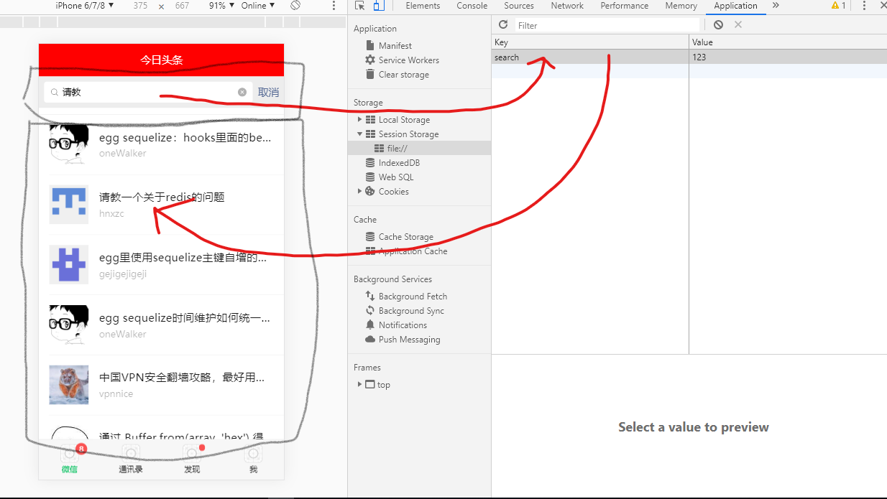

# 组件通信

- 搜索框先把数据存进，本地存储里面
- 列表组件会监听本地存储的改变
- 数据一旦变化，就会触发监听

本地存储就是扮演一个中介，帮助两个组件完成一次通信，组件之间是高度独立的，每次通信需要用中阶层来完成，而本地存储就是这个中介



```js
// 组件1触发的 搜索框触发
window.sessionStorage.setItem('name','yao')

// ------storage------

// 组件2监听的 列表页监听
window.addEventListener("storage", function (e) {
    console.log(e)
    console.log(e.newValue);
});
```